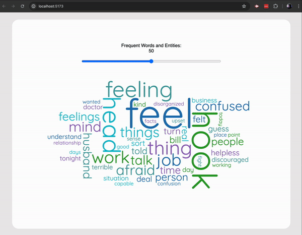

# Word Cloud Visualization

This is a React-based word cloud visualization using D3.js and the `d3-cloud` plugin. You can adjust the number of words displayed in the word cloud using a slider, and each word in the cloud is clickable.

## Features

- Fetches word data from a local JSON file.
- Displays a word cloud where words are sized according to their frequency.
- Allows the number of words displayed to be adjusted via a slider.
- Words in the cloud are clickable and trigger a custom event.



## Installation

1. Clone the repository:

   ```bash
   git clone https://github.com/your-username/word-cloud-visualization.git
   cd word-cloud-visualization
   ```

2. Install the dependencies:

   ```bash
   npm install
   ```

## Usage

1. Make sure you have a `data.json` file in the `public` directory. The JSON file should contain an array of objects with words and their frequencies. Example `data.json`:

   ```json
   [
     {
       "word1": 10,
       "word2": 20,
       "word3": 5,
       "word4": 15
     }
   ]
   ```

2. Start the development server:

   ```bash
   npm run dev
   ```

3. Open your browser and navigate to `http://localhost:3000` to view the word cloud visualization.

## File Structure

```plaintext
word-cloud-visualization/
├── public/
│   ├── data.json
│   ├── index.html
│   └── ...
├── src/
│   ├── components/
│   │   ├── WordCloud.jsx
│   │   └── ...
│   ├── App.js
│   ├── index.js
│   ├── WordCloud.css
│   └── ...
├── .gitignore
├── package.json
├── README.md
└── ...
```

## Built With

- **[React](https://reactjs.org/)** - A JavaScript library for building user interfaces.
- **[Vite](https://vitejs.dev/)** - A fast build tool for modern web projects.
- **[D3](https://d3js.org/)** - A JavaScript library for producing dynamic, interactive data visualizations in web browsers.
- **[D3-cloud](https://github.com/jasondavies/d3-cloud)** - A Word Cloud layout for D3.
- **[React-d3-cloud](https://github.com/Yoctol/react-d3-cloud)** - A React component for creating word clouds using D3-cloud.
- **[W3Schools](https://www.w3schools.com/howto/howto_js_rangeslider.asp)** - Resource for adding and styling a range slider.
- **[ChatGPT](https://openai.com/chatgpt)** - An AI language model by OpenAI, used for generating human-like text based on context and past conversations.
